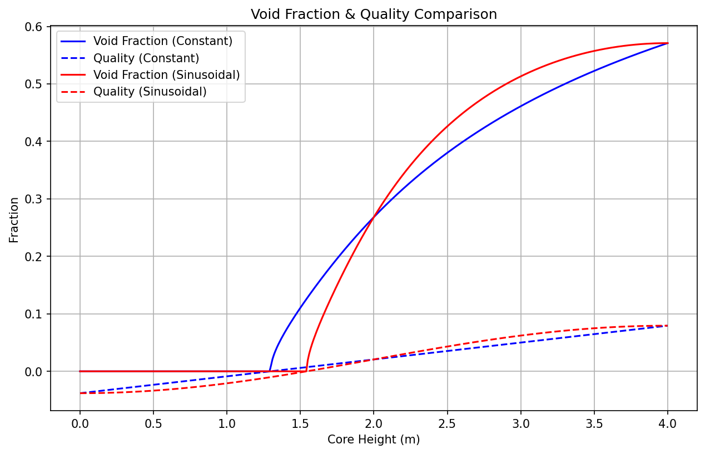
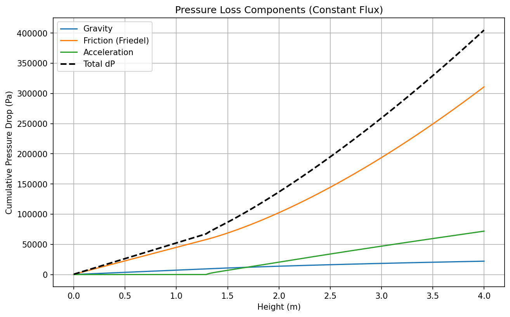
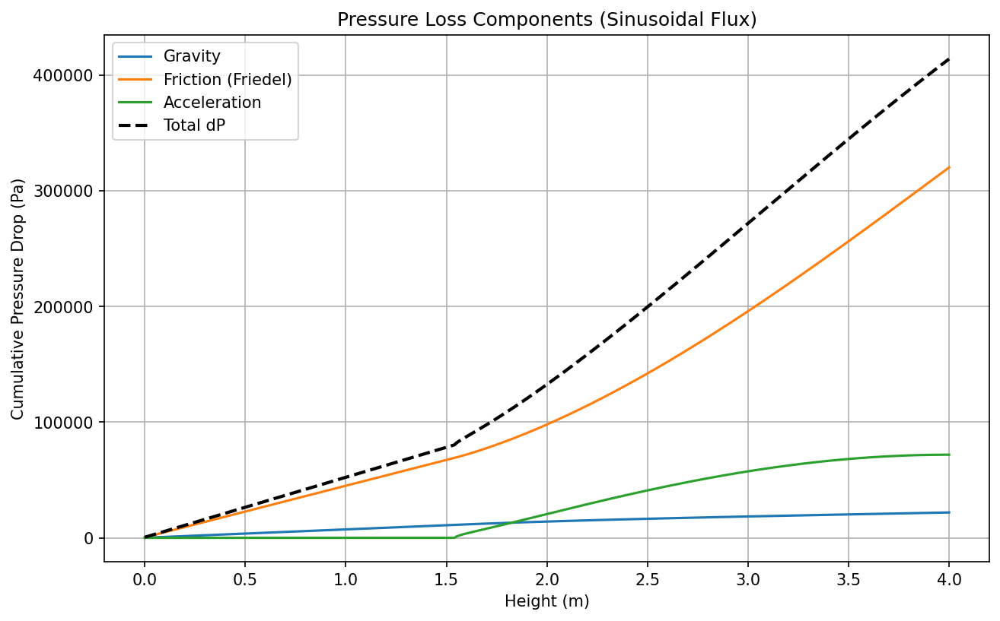
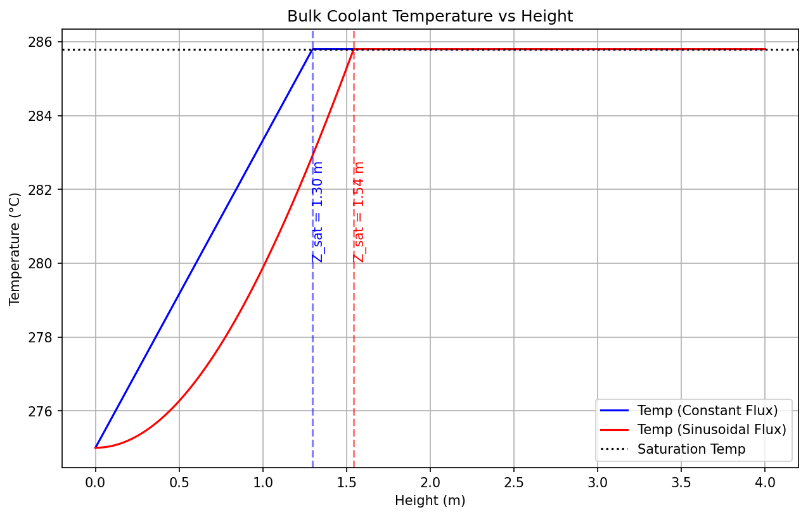
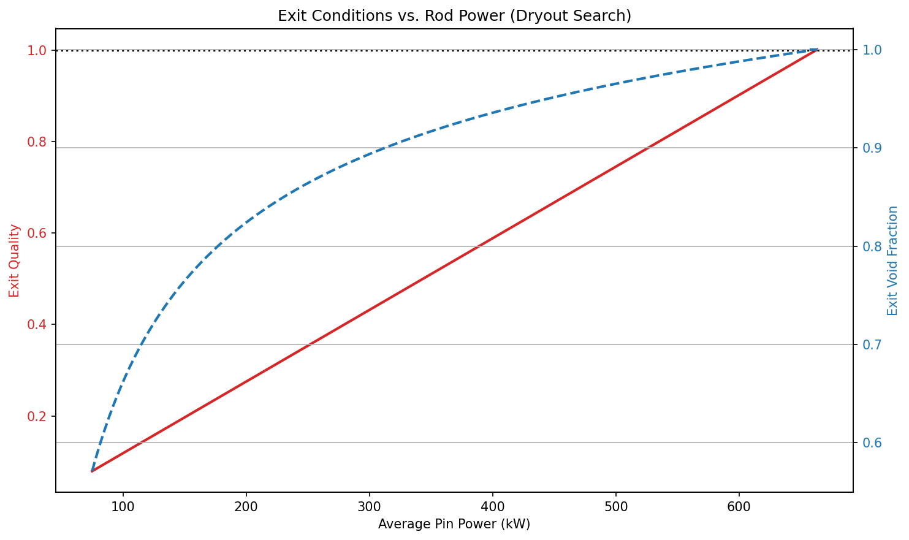

# BWR Sub-Channel Void Fraction & Pressure Drop Analysis

Python implementation of a steady-state two-phase thermal-hydraulic analysis for a Boiling Water Reactor (BWR) hot sub-channel. Computes axial profiles of bulk coolant temperature, equilibrium quality, void fraction, and the friction / acceleration / gravity components of pressure drop, then searches for the rod power at which the channel reaches dry-out.

Built as a final project for NRE 4214 (Reactor Engineering) at Georgia Tech.

## Problem

A single hot sub-channel of a 4,500 MW(th), 60,000-rod BWR core operating at 7.0 MPa system pressure. The analysis is run under two axial power shapes:

1. **Constant heat flux** — uniform `q''` along the rod
2. **Sinusoidal heat flux** — `q''(z) = q''_avg · sin(πz/L)`, integrated to give enthalpy rise `(1 - cos(πz/L)) / 2`

For each case the script reports the axial location at which the bulk coolant reaches saturation, the void-fraction and quality profiles, the pressure-drop breakdown, and the rod power at which exit quality hits 1 (dry-out condition).

## Methodology

| Phenomenon | Correlation | Reference |
|---|---|---|
| Void fraction (drift-flux) | Chexal–Lellouche, solved iteratively with `scipy.optimize.fsolve` | Chexal & Lellouche (1986); Todreas & Kazimi §11 |
| Bundle single-phase friction | Cheng–Todreas with geometric aggregation over interior / edge / corner subchannels of an 8×8 assembly | Todreas & Kazimi §9.5, Eq. 9.106 |
| Two-phase friction multiplier | Friedel | Todreas & Kazimi §11; Friedel (1979) |

The momentum equation is decomposed at every axial step:

```
dP_total = dP_friction + dP_acceleration + dP_gravity
```

- **Friction**: `Φ²_Friedel × (f_lo G² / (2 ρ_f D_e)) dz`
- **Acceleration**: change in two-phase momentum flux `G² × [x²/(ρ_g α) + (1−x)²/(ρ_f (1−α))]` between steps
- **Gravity**: `ρ_bulk g dz` where `ρ_bulk = α ρ_g + (1−α) ρ_f`

Cumulative contributions are integrated over the 4 m rod length with `dz = 1 cm`.

Water properties at 7.0 MPa are taken as fixed saturated values (no IAPWS lookup):

| Property | Value |
|---|---|
| `ρ_f` | 739.72 kg/m³ |
| `ρ_g` | 36.525 kg/m³ |
| `μ_f` | 9.1266e-5 Pa·s |
| `μ_g` | 1.8889e-5 Pa·s |
| `σ` | 0.017633 N/m |
| `h_f` | 1267.7 kJ/kg |
| `h_g` | 2772.6 kJ/kg |
| `T_sat` | 285.8 °C |

## Running

```bash
pip install -r requirements.txt
python void_fraction_BWR.py
```

The script generates the five plots below into `figures/` and prints saturation heights, total pressure drops, and the dry-out rod power.

## Results

### Summary

| Quantity | Constant flux | Sinusoidal flux |
|---|---|---|
| Saturation height | 1.30 m | 1.54 m |
| Total pressure drop | 4.05 bar | 4.14 bar |
| Exit void fraction | 0.57 | 0.57 |

**Dry-out rod power**: **663.33 kW/rod** (~39.8 GW total core) — well above the 75 kW/rod nominal, giving a large operating margin.

### Void fraction & quality



Constant-flux reaches saturation lower in the channel (1.30 m vs 1.54 m) because it deposits more energy in the bottom half. Both cases converge to the same exit void fraction (~0.57) since total heat input is identical.

### Pressure drop decomposition

| Constant flux | Sinusoidal flux |
|---|---|
|  |  |

Friction (Friedel) dominates once the bulk hits saturation. Gravity contribution drops sharply as void fraction climbs — the column gets lighter. Acceleration is a small but non-negligible spike through the subcooled-to-saturated transition.

### Temperature profile



Bulk coolant temperature climbs linearly in the subcooled region, then pins at `T_sat = 285.8 °C` once boiling begins. The saturation height differs between the two power shapes for the reason given above.

### Dry-out search



Exit quality climbs linearly with rod power. Exit void fraction climbs sharply at low quality (drift-flux behavior near `α = 0.6`) then asymptotically approaches 1. Dry-out (exit quality = 1) lands at **663 kW/rod**.

The full written discussion lives in [`report/Final Project Report.docx`](report/Final%20Project%20Report.docx).

## References

1. N. E. Todreas and M. S. Kazimi, *Nuclear Systems Volume 1: Thermal-Hydraulic Fundamentals*, 3rd ed., CRC Press, 2021.
2. B. Chexal and G. S. Lellouche, "A Full-Range Drift-Flux Correlation for Vertical Flows (Revision 1)," EPRI NP-3989-SR, 1986.
3. L. Friedel, "Improved Friction Pressure Drop Correlations for Horizontal and Vertical Two-Phase Pipe Flow," European Two-Phase Flow Group Meeting, Ispra, 1979.
4. S. K. Cheng and N. E. Todreas, "Hydrodynamic Models and Correlations for Bare and Wire-Wrapped Hexagonal Rod Bundles," *Nuclear Engineering and Design*, 1986.

## License

MIT — see `LICENSE`.

## Author

Francesco Vezzola
